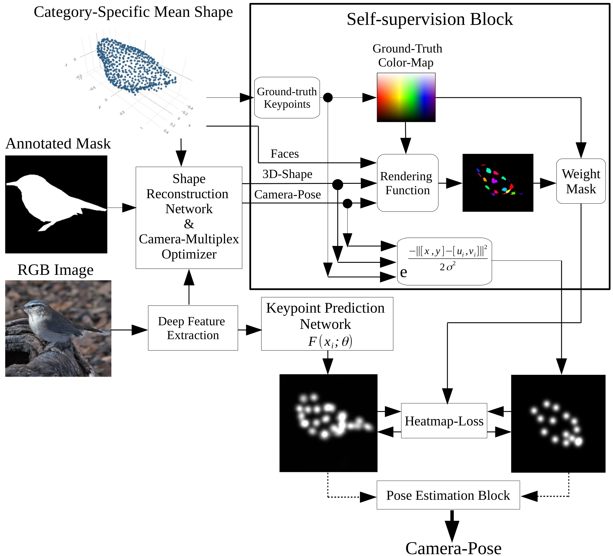
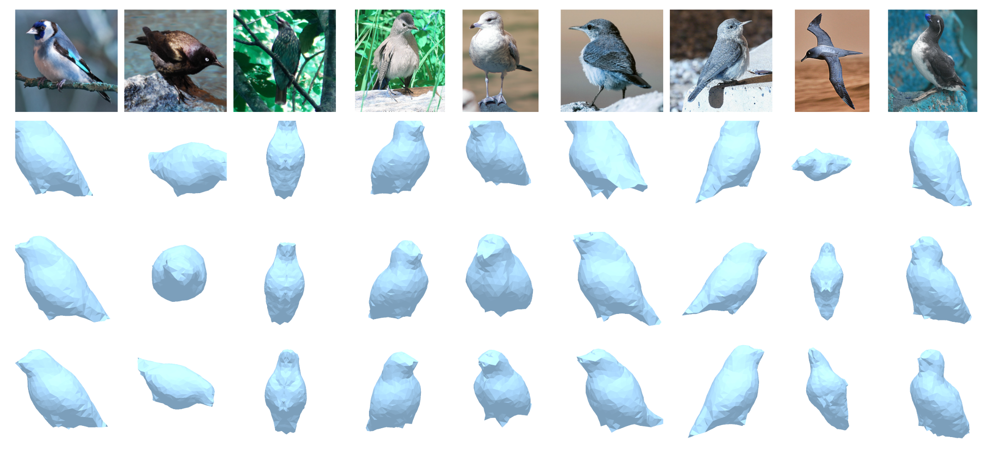
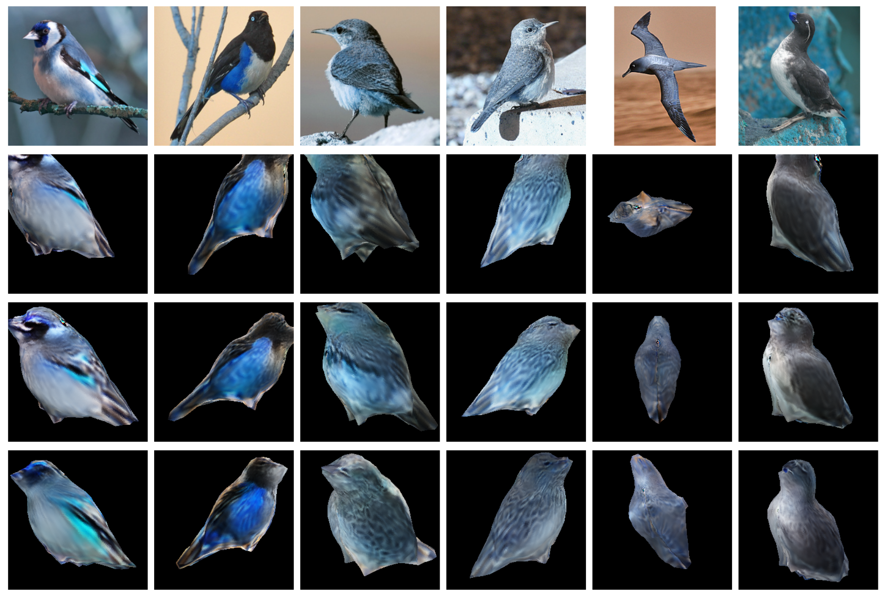
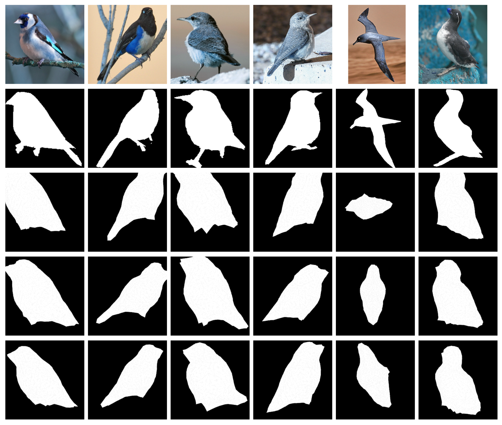
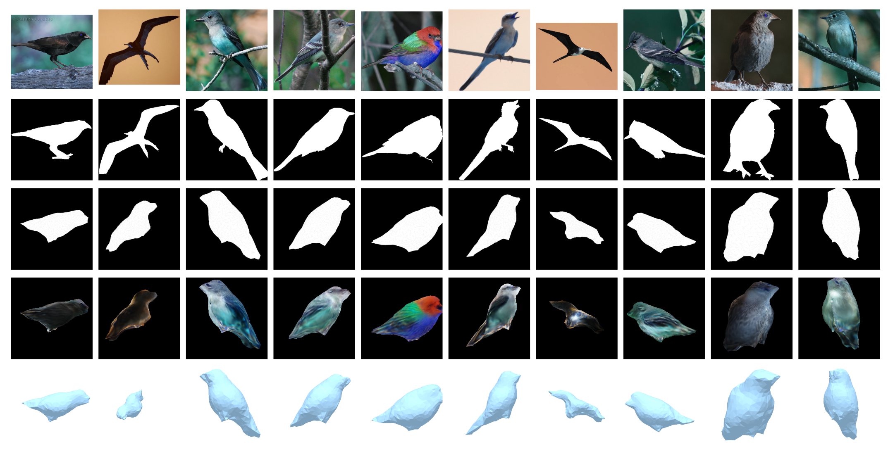
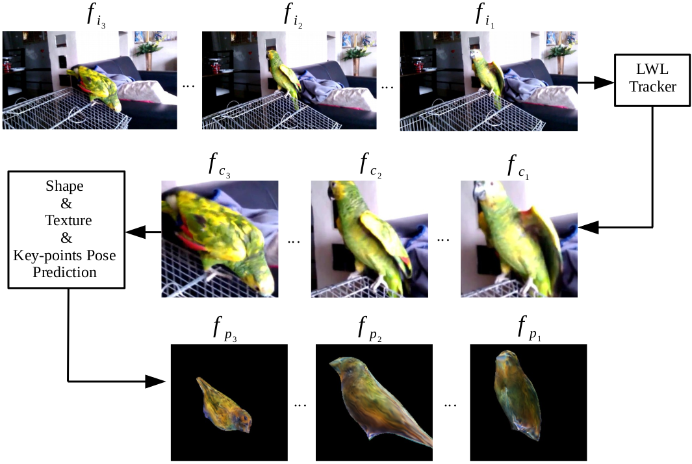
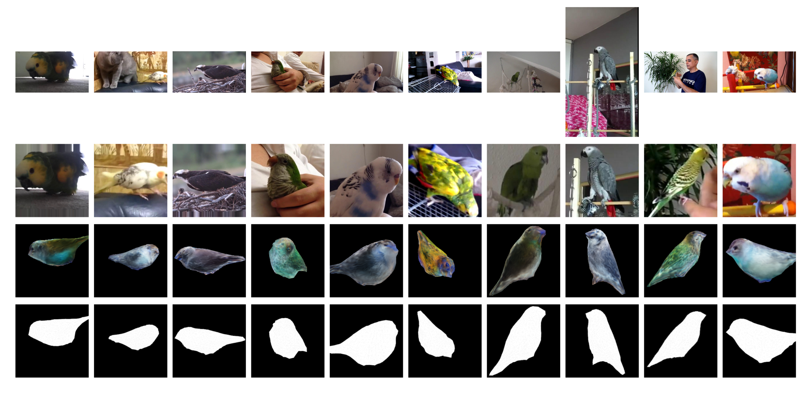

# SLOPE-KP

<div align="center">
  
  <p><b>Figure 1:</b> SLOP-KP: Self-supervised Learning of Object Pose Estimation Using Keypoint Prediction.
</div>


Overview
--------
This repository hosts the code for the **SLOPE_KP**: Self-supervised Learning of Object Pose Estimation Using Keypoint Prediction
which outlines advancements in predicting both object pose (camera perspective) and shape from **single images**. 
The key innovation is a novel approach to predicting camera pose using self-supervised learning of keypoints—specific 
points located on a deformable shape that is typical for a particular object category (like birds, cars, etc.).

If you make use of the SLOPE-KP and/or this code repository, please cite the following [paper](https://arxiv.org/abs/2302.07360):

```bibtex
@article{gharaee2023self,
  title={Self-supervised learning of object pose estimation using keypoint prediction},
  author={Gharaee, Zahra and Lawin, Felix J{\"a}remo and Forss{\'e}n, Per-Erik},
  journal={arXiv preprint arXiv:2302.07360},
  year={2023}
}
```

We conducted our experiments to compare four different approaches to rotation representation. 
- The first is to predict 4D unit quaternions by a CNN.
- The second is 6D rotation representation mapped onto SO(3) via a partial Gram-Schmidt procedure.
- The third is special orthogonalization using SVD based on 9D rotation representation. 
- The fourth is our novel approach to camera pose prediction, which trains an intermediate **keypoint prediction network**.


**Table 1**: The results of a single 3D object reconstruction presented by mean intersection over union (Mean-IoU) and 3D-Angular-Error calculated for the CUB test set when predicting camera pose by four different approaches: unit quaternions, Gram-Schmidt, special orthogonalization, and keypoint prediction. Note that the category-specific mesh reconstruction network CMR had a 3D-Angular error equal to 87.52° when no viewpoint and keypoint supervision are used.

| Method | Mean-IoU &#8593; | 3D-Angular-Error &#8595; |
| --- | --- | --- |
| Quaternion [Goel et. al (2020)](https://arxiv.org/abs/2007.10982) | 0.62 | 45.5° |
| Gram-Schmidt [Zhou et. al (2020)](https://arxiv.org/abs/1812.07035) | 0.55 | 60.4° |
| SVD [Levinson et. al (2020)](https://arxiv.org/abs/2006.14616) | 0.58 | 50.8° |
| **Keypoint (ours)** | **0.70** | **40.5°** |

> **Note**: The arrows next to the column headers indicate the direction of improvement (upward for Mean-IoU and downward for 3D-Angular-Error).


<h3>3D Shape Prediction</h3>

<div align="center">
  
</div>

**Figure 2**:The first row displays the original images of nine different bird species from the CUB dataset. <br />
  The second row presents the 3D meshes reconstructed using the ground-truth camera poses provided by the dataset through Structure from Motion (SfM). <br />
  The third row showcases the 3D shapes reconstructed when camera poses are predicted using unit quaternions. <br />
  Finally, the fourth row illustrates the 3D shapes obtained using camera poses predicted from keypoint correspondences.</p>


<h3>Texture Prediction</h3>

<div align="center">
  
</div>

**Figure 3**: The first row displays original images of six different bird species from the CUB dataset. <br />
  The second row shows textures reconstructed using the SfM camera poses for rendering. <br />
  The third and fourth rows present textures reconstructed with camera poses predicted by unit quaternions and the keypoint pose trainer, respectively.</p>


<h3>Mask Prediction</h3>

<div align="center">
  
</div>

**Figure 4**:The first row displays original RGB images of six different bird species from the CUB dataset. <br />
  The second row presents the ground-truth masks provided by the dataset. <br />
  The third row shows rendered masks using SfM camera poses. <br />
  The fourth and fifth rows depict reconstructed masks using camera poses predicted by unit quaternions and keypoint correspondences, respectively.</p>


<h3>Image Reconstruction</h3>

<div align="center">
  
</div>

**Figure 5**: The first row displays original images of ten different bird species from the CUB dataset. <br />
            The second row presents the ground-truth annotations provided by the dataset. <br />
            The third and fourth rows show the masks and textures reconstructed using camera poses predicted by keypoints. <br />
            The fifth row depicts the 3D shape reconstructed from the camera pose predictions


## Online Inference 3D Object Reconstruction from Videos

We conduct online experiments to infer 3D objects from video sequences with single and multiple objects per image, 
using the YouTubeVos and Davis datasets [Xu et al. (2018)](https://arxiv.org/abs/1809.03327), 
focusing on the bird category. Inferring objects from video sequences is challenging due to varying positions, 
orientations, and occlusions. We use LWL [Bhat et al. (2020)](https://arxiv.org/abs/2003.11540) to compute 
bounding boxes from the predicted masks.

Bounding boxes are utilized to crop frames and create image patches, which are then fed into the reconstruction network. 
This network predicts the shape, texture, and camera pose of the objects. We compare the masks reconstructed by 
our method with those generated by three other approaches against the ground-truth masks. Model performance 
is evaluated using three metrics: Jaccard-Mean (mean intersection over union), Jaccard-Recall (mean fraction of values exceeding a threshold), 
and Jaccard-Decay (performance loss over time).

The LWL tracker detects and tracks all birds, cropping the corresponding images using the predicted bounding boxes for each bird. 
The cropped patches are then processed by a pretrained mesh reconstruction model to predict the camera pose, 
addressing the perspective-n-point problem through keypoint correspondences.

**Table 2**: Table 2: Davis Jaccard Mean, Recall, and Decay for the YouTubeVos and Davis Datasets

| Method | Jaccard-Mean &#8593; | Jaccard-Recall &#8593; | Jaccard-Decay &#8595; |
| --- | --- | --- | --- |
| Quaternion [Goel et. al (2020)](https://arxiv.org/abs/2007.10982) | 0.45 | 0.48 | 0.020 |
| Gram-Schmidt [Zhou et. al (2020)](https://arxiv.org/abs/1812.07035) | 0.40 | 0.27 | 0.007 |
| SVD [Levinson et. al (2020)](https://arxiv.org/abs/2006.14616) | 0.44 | 0.43 | 0.028 |
| **Keypoint (ours)** | **0.45** | **0.53** | **0.018** |

> **Note**: The arrows next to the column headers indicate the direction of improvement (upward for Jaccard-Mean and Jaccard-Recall, and downward for Jaccard-Decay).

<div align="center">
  
</div>

**Figure 6**: Online video object reconstruction framework. This example is from the YouTubeVos test set.  
The first row shows the original RGB images, and the second row shows the image patches generated by cropping using predicted bounding boxes from the LWL tracker.  
The third row shows the reconstructed shape and texture.

<div align="center">
  
</div>

**Figure 7**: The first row displays original images of 10 birds from the YouTubeVos and Davis video sequences.
            The second row presents image patches cropped using the bounding box dimensions predicted by the LWL tracker.
            The third and fourth rows show reconstructed textures and masks obtained using a 3D object reconstruction model,
            where keypoint correspondences are used to predict the camera poses capturing the images.


## Getting Started with SLOPE-KP

To set up the SLOPE-KP project, follow the steps below:

### Clone the Repository

First, recursively clone the repository along with its linked dependencies (submodules):

```bash
git clone --recursive git@github.com:zahrag/SLOPE-KP.git
cd SLOPE-KP
```

### Install Dependencies

Next, please follow the installation [instructions](https://github.com/shubham-goel/ucmr/blob/master/docs/installation.md) 
to install the additional dependencies: **PyMesh**, **SoftRas**, and **NMR**.

Alternatively, you can use the provided `environment.yaml` file to install all required packages by running:

```bash
conda env create -f environment.yaml
```

### Dataset 

Download CUB-200-2011 images:

```bash
wget http://www.vision.caltech.edu/visipedia-data/CUB-200-2011/CUB_200_2011.tgz && tar -xf CUB_200_2011.tgz
```

### Annotations
Access the annotation files, the split, and the template for the category-specific mean shape used in our experiments, 
similar to the ucmr project, via the **data** directory.

### Experiments
After configuring the experiment hyperparameters in **codes/configs/configs.yaml**, run `run_init_multiplex.py` to 
initialize and optimize the camera multiplex. Then, utilize `run_composite_model.py` to train the shape, texture, and pose of the object. 
This repository supports four different approaches to pose prediction.

## Acknowledgements
We acknowledge the [ucmr](https://github.com/shubham-goel/ucmr/tree/master) for providing integral code elements utilized in our work.

